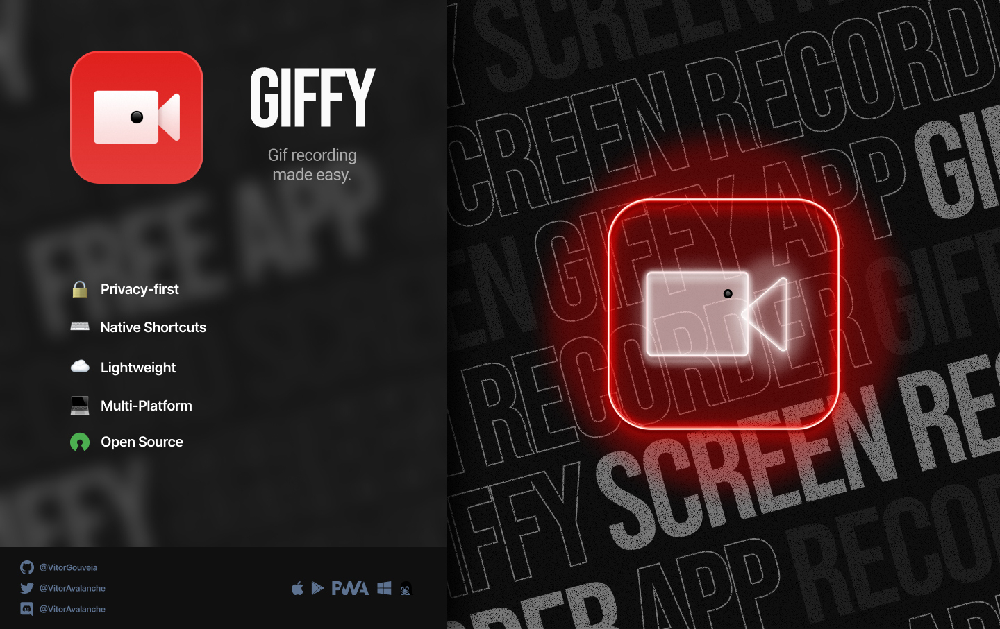

<div align="center">
  <a href="https://vitorgouveia.github.io/Giffy">
    
  </a>
</div>

<div align="center">
  <a href="https://www.figma.com/file/JrvfChRpuKFnxZopbbAi3M/Giffy?node-id=2%3A20">
  figma
  </a>
</div>

<br />

<div align="center">
  
  

  <a href="https://github.com/VitorGouveia/Giffy/blob/master/LICENSE.md">
    
  </a>

  <a href="https://github.com/VitorGouveia/Giffy/releases/latest">
    
  </a>
</div>

<br />



> Giffy is a GIF screen recorder app.

<sub>
  based on: <a href="https://www.veed.io">VEED.IO</a>,
  <a href="https://dribbble.com/shots/14521743-Screen-Recorder">Sandor's Screen Recorder</a>,
  <a href="https://www.dwinawan.com/blog">Dwinawan's Blog</a> and
  <a href="https://www.pixelmatters.com/blog">Pixelmatter's Blog</a>
</sub>

---

<br />

## Tecnologies

<br />

<a href="https://yarnpkg.com">
  
</a>

<a href="https://www.w3.org/html">
  
</a>

<a href="https://sass-lang.com">
  
</a>

<a href="https://postcss.org/">
  
</a>

<a href="https://reactjs.org/">
  
</a>

<a href="https://nextjs.org/">
  
</a>

<a href="https://storybook.js.org/">
  
</a>

<a href="https://www.typescriptlang.org/">
  
</a>

<a href="https://babeljs.io/">
  
</a>

<a href="https://webpack.js.org/">
  
</a>

<a href="https://github.com/features/actions">
  
</a>

<a href="https://eslint.org/">
  
</a>

<a href="https://prettier.io/">
  
</a>

<br />
<br />
<br />

### 🛠️ Adjusts and Updates

The project is still in development and the next updates will be:

- [ ] Blog
- [ ] Landing Page
- [ ] Desktop and Mobile App
- [ ] Account System
- [ ] 💸 Monetization

---

🚧 Giffy is under development and not ready yet to be downloaded 🚧

---

## 📫 Contributing to Giffy

Before contributing, check if you attend the requirements:

1. Choose a [issue](https://github.com/VitorGouveia/Giffy/issues), if there are none, create your own issue
2. Fork this repository.
3. Create a branch with the name of your feature/bug fix.
4. Commit your changes.
5. Merge the new branch into the _master_ branch.
6. Make a pull request.

<br />

## Development

to get started in development first clone the repo

```bash
git clone https://github.com/VitorGouveia/Giffy.git
```

### Remember
this is a **yarn workspaces** app, so you must use yarn to install the dependencies, otherwise things will break

to install yarn, do

```bash
npm i yarn -g
```

then, install the dependencies

```bash
yarn
```

## Issues

before developing take a look at [issues](#https://github.com/VitorGouveia/Giffy/issues) and choose one you wanna solve,

<br />

## Projects

Basically, Giffy is split up in two parts, one part contains all the apps and the other part contains all the building block of these apps

|Workspace|Description|
|------|-----------|
|[packages](#project-packages)|All the building blocks of the apps(styling, components, common logic, etc)|
|[apps](#project-apps)|All the apps that Giffy will have, mobile, desktop, website, etc|

<br />

<h3 id="project-packages">Packages</h3>

|Folder|Description|
|------|-----------|
|[styles](#styles-guide)| All the css code, follow a guide for that in [here](#styles-guide)|
|[ui](#ui-guide)|All the React UI components, follow a guide for that in [here](#ui-guide)|


<br />

<h3 id="project-apps">Apps</h3>

|Folder|Description|
|------|-----------|
|[web](#web-guide)| A Next.js web app, follow a guide for that in [here](#web-guide)|

<br />

<h2 id="styles-guide">Styles Guide</h2>

This a package composed of Sass and PostCSS plugins, it contains the whole css of the apps,

<h3 id="styles-guide-development">Development</h3>

to start developing in styles, run the development server:

`yarn dev` - this will start sass
`yarn compile:dev` - this will start postcss

to develop for any of the other packages, you **need** to run _both_ of the scripts

<br />

<h2 id="ui-guide">UI Guide</h2>

**This package depends on `Styles` to be running**, so make sure you [start that](#styles-guide-development) first

This a package composed of:

- Storybook - for the preview of the components
- Babel - to compile all our react code into minified javascript

<h3 id="ui-guide-development">Development</h3>

to start developing in ui, run the development server:

`yarn storybook` - this will start storybook and open your browser on the components page

<h3 id="ui-guide-build">Build</h3>

to build it, just run:

`yarn build` - this will build all the components into javascript


<br />

<h2 id="ui-guide">Web Guide</h2>

<h3>This package depends on `UI` to be built**, so make sure you [build that](#ui-guide-build) first</h3>

This is a package composed of:
- Next.js - the whole thing

<h3>Be aware that, this will not work as of today because I still need to find a way to prefix React Classnames in the [UI](#ui-guide) lib, sorry :/</h3>
to start developing in Web, run the development server:

```
yarn dev
```

<br />

## 🤝 Colaborators

I thank everybody that colaborated to this project:

<table>
  <tr>
    <td align="center">
      <a href="http://github.com/vitorGouveia">
        <br>
        <sub>
          <b>Me</b>
        </sub>
      </a>
    </td>
  </tr>
</table>

## 📝 License

This project is under the MIT license. See the [license](LICENSE.md) file for mode details.

---

## Creator

My name is [Vitor Gouveia](https://github.com/VitorGouveia), i am a 16 year old developer who really likes to create apps using over-engineered tech stacks.

<br />

### **Contact**

If you to get in contact with me, here are my social media:

<a href="https://www.linkedin.com/in/vitor-neves-gomes-gouveia-08ba391a7">
  
</a>

<a href="https://github.com/VitorGouveia">
  
</a>

<a href="#">
  
</a>

<a href="https://twitter.com/VitorAvalanche">
  
</a>

<a href="https://www.instagram.com/vitor_.gouveia">
  
</a>
